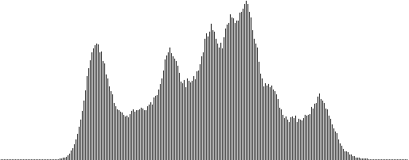
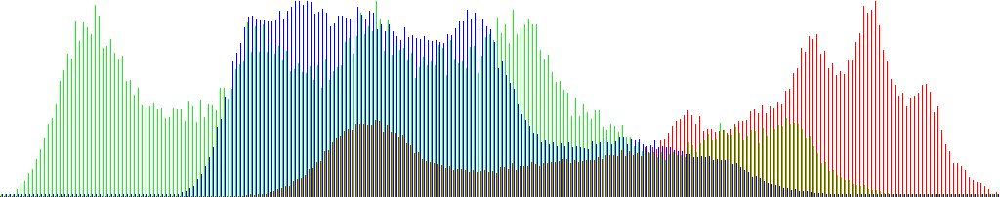

# Installation
## With Rust
install [rust]("https://www.rust-lang.org/learn/get-started")
run `cargo run -- --help` on the root of the project

## As a binarie
### File
You can also use it like a binary with the file `image-utility` so you don't need to 
have rust of anything else install run it by doing `./image-utility` at the root

### Debian
You can install it like a debian package double click the file `image-utility_0.1.0_amd64.deb` and follow the step or
run on the root `sudo dpkg -i image-utility_0.1.0_amd64.deb`

# Description
`image-utility` is a really light and easy to use cli tools to do some basic image-processing like 
resize, rotate, blur without the need to open a heavy software like GIMP, I decided
to make the program the more intuitive possible so unlike some other cli tools.
This one will ask the parameters of the action you want to do after you have selected.

What does it mean? It means that you don't have to type a long line like `image-utility path path2 resize dim1 dim2`
It will ask more information once you have selected an action so you don't have to remember a lot of things to use this program
There also a link at the end when the processing is done to rapidly view the result of the operation
Can generate two type of histogram (rgb or gray).

To do the processing part i use (except histogram): [image](https://github.com/image-rs/image)
and for the cli part : [clap](https://github.com/clap-rs/clap), [anyhom](https://github.com/dtolnay/anyhow), [indicatif](https://github.com/console-rs/indicatif)

# Histogram 
You have 2 options for the generator of histograms for analytical use 
**Grey** and **RGB** the first one will do a average of the blue red and green component 
and rgb will show 3 differents curve.

## Exemple Lenna
This histogram are the result on Lenna 

Grey:

 

rgb:

