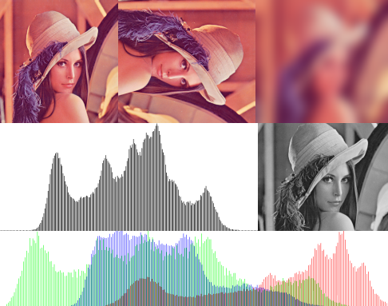

# Installation
## With Rust
install [rust]("https://www.rust-lang.org/learn/get-started")
run `cargo run -- --help` on the root of the project

## As a binary
### File
You have a binary file who contains the program so you don't need to
have rust or anything else
#### Linux
You can also use it as a binary with the file `image-utility` in `install`
Run it by doing `./install/image-utility` at the root of the project

#### Window
You have the file `image-utility.exe` in `install`

### Debian
You can install it like a Debian package double click the file `image-utility_0.1.0_amd64.deb` in `install` and follow the step or
run on the root of the project `sudo dpkg -i install/image-utility_0.1.0_amd64.deb`

# Description
`image-utility` is a light and easy-to-use cli tool to do some basic image-processing like 
resize, rotate, blur without the need to open a heavy software like GIMP, I decided
to make the program the more intuitive possible so unlike some other cli tools.
This one will ask the parameters of the action you want to do after you have selected.

What does it mean? It means that you don't have to type a long line like `image-utility path path2 resize dim1 dim2`
It will ask for more information once you have selected an action so you don't have to remember a lot of things to use this program
There is also a link at the end when the processing is done to rapidly view the result of the operation
Can generate two types of histogram (rgb or gray).

To do the processing part I use (except histogram): [image](https://github.com/image-rs/image)

For the cli part : [clap](https://github.com/clap-rs/clap), [anyhom](https://github.com/dtolnay/anyhow), [indicatif](https://github.com/console-rs/indicatif)

# Histogram 
You have 2 options for the generator of histograms for analytical use 
**Grey** and **RGB** the first one will do an average of the blue red and green components 
and rgb will show 3 different curves.

## Exemple result
These will use Lenna

 
